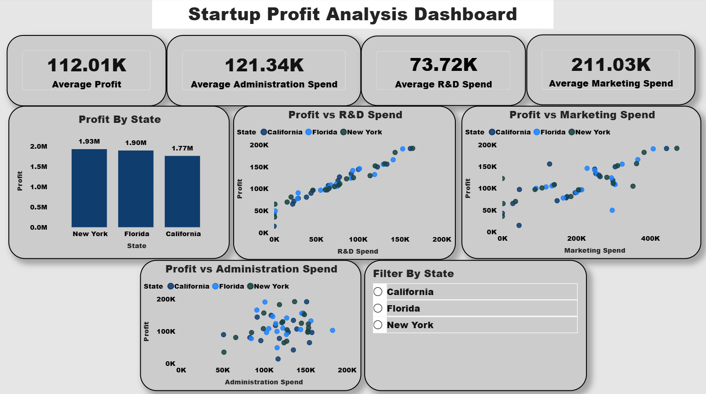
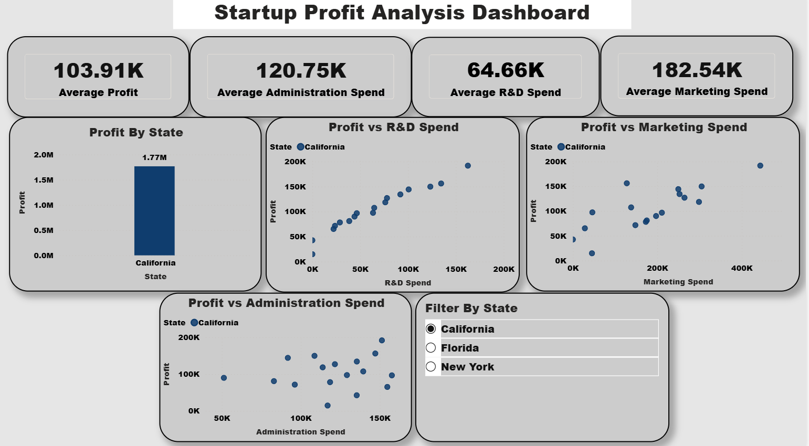
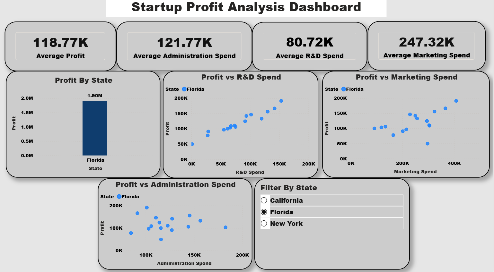

# Startup Profit Analysis

## Overview
This project analyzes startup data to identify the factors influencing company profit. The analysis includes data cleaning, exploratory data analysis (EDA), visualization, and predictive modeling using Multiple Linear Regression.

## Tools & Technologies
- Python
- Pandas
- NumPy
- Matplotlib
- Scikit-learn
- SQL (MySQL)
- Power BI

## Project Workflow
- Imported and cleaned the dataset
- Performed Exploratory Data Analysis (EDA)
- Built interactive Power BI dashboards
- Developed a Multiple Linear Regression model
- Predicted startup profits
- Generated business insights and recommendations

## Files
- 📊 Power BI Dashboard (.pbix)
- 🐍 Python Notebook (.ipynb)
- 📄 Project Report
- 📽️ Project Presentation
- 🖼️ Dashboard Screenshots

## Dashboard Preview

### Overall Dashboard

### California Dashboard

### Florida Dashboard

### New York Dashboard

## Key Insights
- R&D spending had the strongest positive impact on profit.
- Marketing expenditure showed a moderate influence.
- Administration spending had a relatively lower impact.
- The regression model was used to predict startup profitability.

## Author
*Varun VG*
